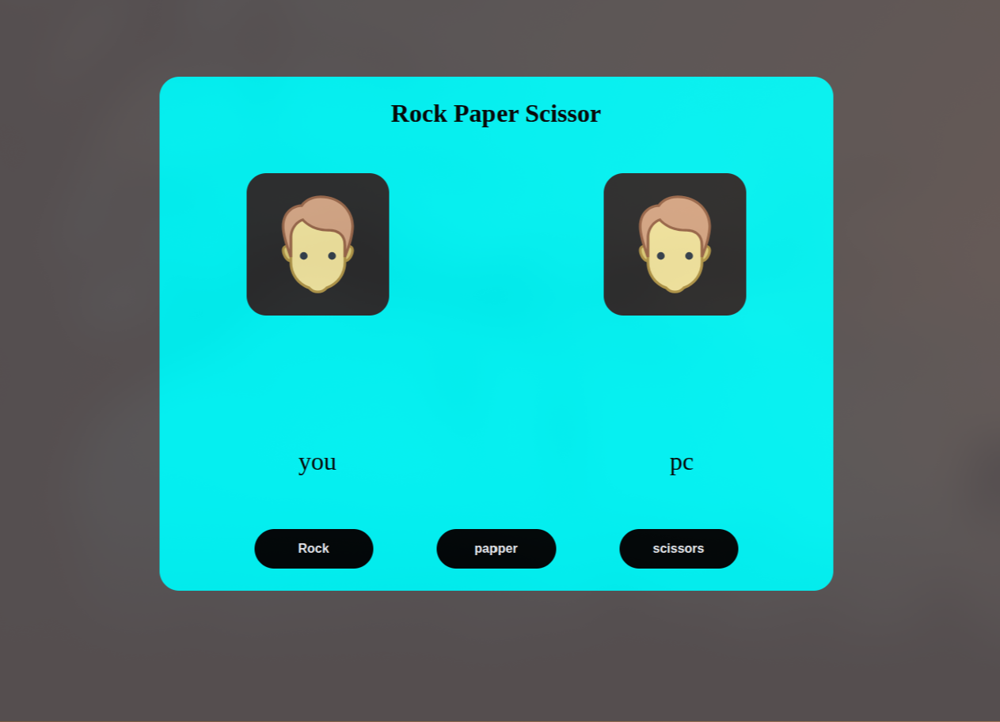
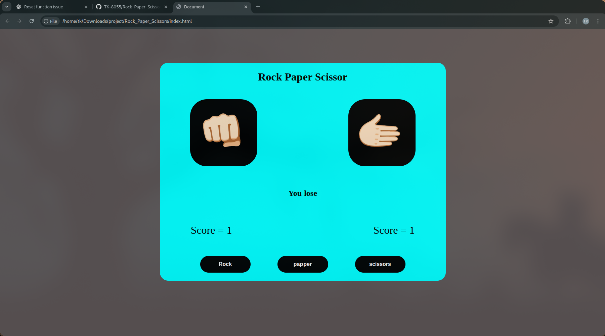
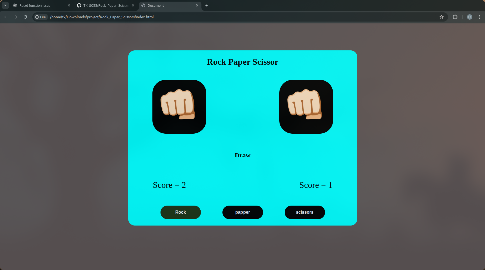
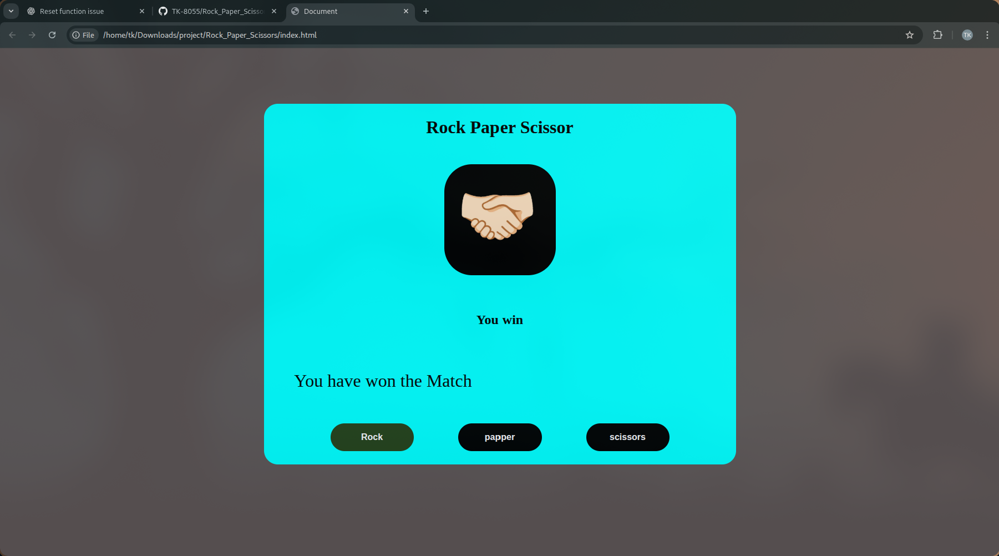

# ✊✋✌️ Rock Paper Scissors Game

A simple Rock Paper Scissors game built using **HTML**, **CSS**, and **JavaScript**. Play against the computer and see who reaches 3 points first!

---

## 📸 Screenshots

  
  
  
  

---

## ⚙️ Features

- 🧠 Computer makes random moves
- 🎮 Tracks scores
- 🏆 Declares winner when score reaches 3
- ♻️ Resets game automatically after match ends
- 🎨 Emoji graphics for moves ( ✊ ✋ ✌️ )

---

## 🛠️ Tech Stack

- HTML
- CSS
- JavaScript

